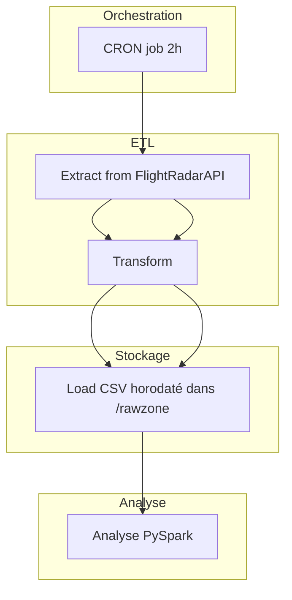
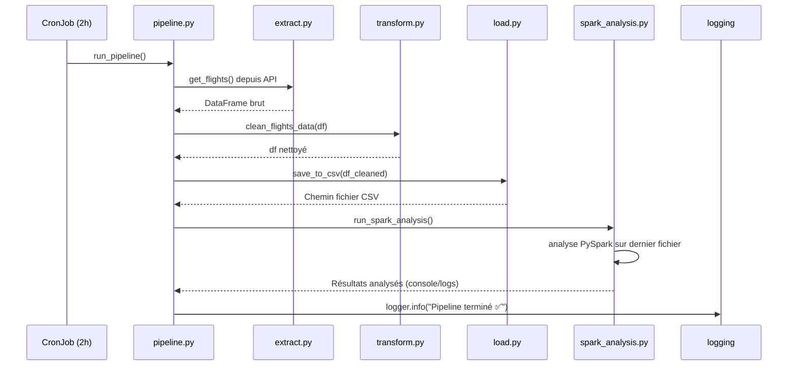
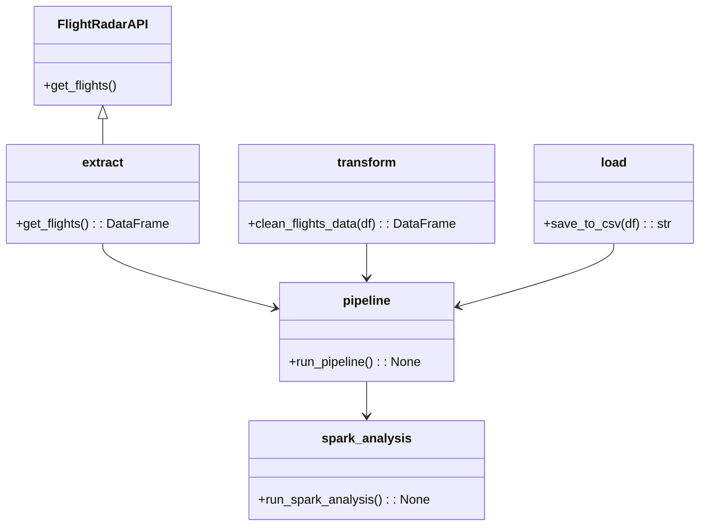

# 📊 Architecture du projet FlightRadar24 ETL (Diagramme Mermaid)

```mermaid
flowchart TD
    A[CRON job 2h] --> B[Extract from FlightRadarAPI]
    B --> C[Transform]
    C --> D[Load CSV horodaté dans /rawzone]

    D --> E[Analyse PySpark]

    subgraph Stockage
        D
    end

    subgraph Orchestration
        A
    end

    subgraph ETL
        B --> C --> D
    end

    subgraph Analyse
        E
    end

```

## Diagramme de Séquence – Exécution du pipeline

```mermaid
sequenceDiagram
    participant CRON as CronJob (2h)
    participant Pipeline as pipeline.py
    participant Extract as extract.py
    participant Transform as transform.py
    participant Load as load.py
    participant Spark as spark_analysis.py
    participant Log as logging

    CRON->>Pipeline: run_pipeline()
    Pipeline->>Extract: get_flights() depuis API
    Extract-->>Pipeline: DataFrame brut
    Pipeline->>Transform: clean_flights_data(df)
    Transform-->>Pipeline: df nettoyé
    Pipeline->>Load: save_to_csv(df_cleaned)
    Load-->>Pipeline: Chemin fichier CSV

    Pipeline->>Spark: run_spark_analysis()
    Spark->>Spark: analyse PySpark sur dernier fichier
    Spark-->>Pipeline: Résultats analysés (console/logs)

    Pipeline->>Log: logger.info("Pipeline terminé ✅")

```

## Diagramme de classes – Structure logique du code

```mermaid
classDiagram

class FlightRadarAPI {
    +get_flights()
}

class extract {
    +get_flights() : DataFrame
}

class transform {
    +clean_flights_data(df) : DataFrame
}

class load {
    +save_to_csv(df) : str
}

class pipeline {
    +run_pipeline() : None
}

class spark_analysis {
    +run_spark_analysis() : None
}

FlightRadarAPI <|-- extract
extract --> pipeline
transform --> pipeline
load --> pipeline
pipeline --> spark_analysis
```